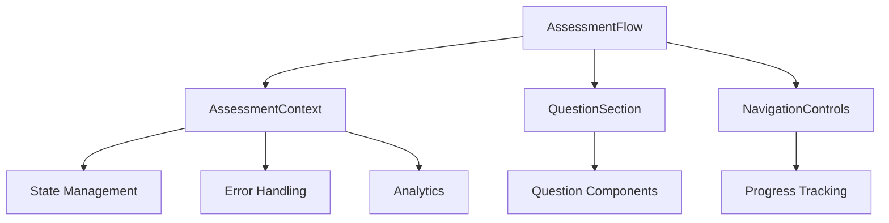
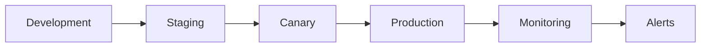

# Assessment Flow Architecture

## System Architecture



## Core Components

### 1. AssessmentFlow
The main controller component managing the assessment flow.

```typescript
interface AssessmentFlowProps {
  onComplete?: (results: AssessmentResults) => void;
  initialStep?: number;
  config?: AssessmentConfig;
}
```

Key responsibilities:
- State management
- Navigation control
- Error handling
- Progress tracking
- Analytics integration

### 2. State Management

```typescript
interface AssessmentState {
  currentStep: number;
  totalSteps: number;
  responses: Record<string, any>;
  completed: boolean;
  error: Error | null;
  isLoading: boolean;
}
```

State flow:
1. User input → validation
2. State update → persistence
3. Side effects → analytics
4. Error handling → recovery

### 3. Error Handling

```typescript
type ErrorType = 'network' | 'validation' | 'state' | 'unknown';

interface ErrorConfig {
  type: ErrorType;
  retryable: boolean;
  userMessage: string;
  recovery?: () => Promise<void>;
}
```

Error handling strategy:
1. Type-specific handling
2. Automatic recovery
3. User feedback
4. Error reporting

## Performance Considerations

### 1. Bundle Size
- Main bundle: < 500KB
- Dynamic imports for heavy components
- Code splitting by route
- Tree shaking optimization

### 2. Runtime Performance
- Debounced inputs
- Memoized calculations
- Virtualized lists
- Optimized re-renders

### 3. Network Optimization
- API request batching
- Response caching
- Offline support
- Progressive loading

## Security Measures

### 1. Data Protection
- Input sanitization
- XSS prevention
- CSRF protection
- Data encryption

### 2. Access Control
- Role-based access
- Session management
- Rate limiting
- Audit logging

## Monitoring & Analytics

### 1. Performance Metrics
```typescript
interface PerformanceMetrics {
  timeToInteractive: number;
  firstContentfulPaint: number;
  totalBlockingTime: number;
  cumulativeLayoutShift: number;
}
```

### 2. User Analytics
```typescript
interface UserJourney {
  stepCompletionTimes: Record<number, number>;
  totalTime: number;
  errorCount: number;
  retryAttempts: number;
}
```

### 3. Error Tracking
```typescript
interface ErrorReport {
  type: ErrorType;
  message: string;
  stack: string;
  userContext: UserContext;
  timestamp: string;
}
```

## State Migration

### 1. Migration Strategy
```typescript
interface StateMigration {
  version: number;
  migrate: (oldState: any) => Promise<AssessmentState>;
  validate: (state: AssessmentState) => boolean;
}
```

Migration process:
1. Version detection
2. Data transformation
3. Validation
4. State update

## Testing Strategy

### 1. Unit Tests
- Component rendering
- State management
- Error handling
- Validation logic

### 2. Integration Tests
- User flows
- API integration
- Error scenarios
- State persistence

### 3. Performance Tests
- Bundle size
- Render times
- Memory usage
- Network calls

## Deployment Architecture



### 1. Environment Configuration
```typescript
interface EnvironmentConfig {
  apiEndpoints: Record<string, string>;
  featureFlags: Record<string, boolean>;
  monitoring: MonitoringConfig;
  errorReporting: ErrorConfig;
}
```

### 2. Feature Flags
```typescript
interface FeatureFlags {
  enableNewQuestions: boolean;
  enableAIAnalysis: boolean;
  enableRealTimeValidation: boolean;
  enableProgressiveProfiling: boolean;
}
```

## Future Considerations

1. **Scalability**
   - Microservices architecture
   - Serverless functions
   - Edge computing
   - Global CDN

2. **AI Integration**
   - Real-time analysis
   - Personalized flow
   - Smart validation
   - Predictive analytics

3. **Accessibility**
   - WCAG 2.1 Level AAA
   - Screen reader optimization
   - Keyboard navigation
   - Color contrast

4. **Internationalization**
   - RTL support
   - Dynamic translations
   - Cultural adaptations
   - Regional compliance
