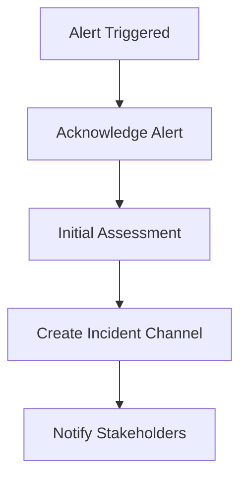
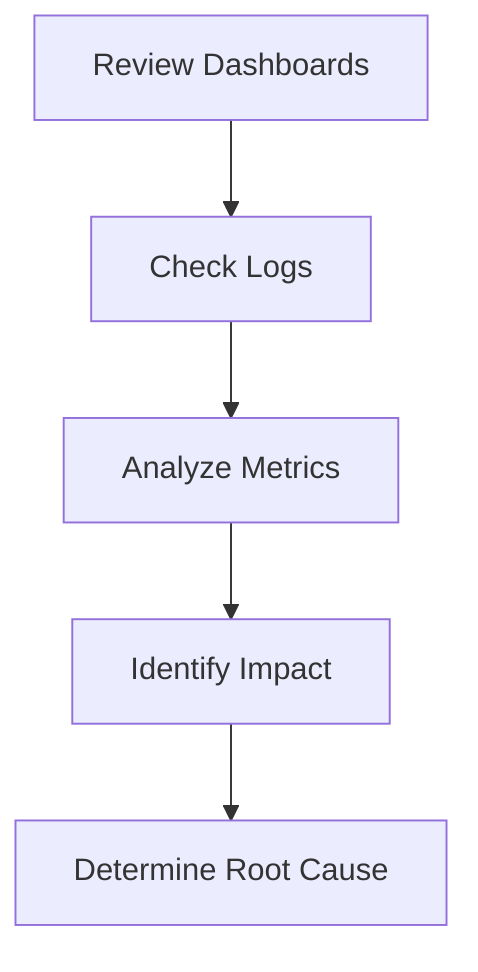

# Assessment Flow Incident Response Runbook

## Severity Levels

### Severity 1 (Critical)
- System is down or unusable
- Data loss or corruption
- Security breach
- Response Time: Immediate (< 15 minutes)

### Severity 2 (High)
- Major functionality impaired
- Significant performance degradation
- High error rates
- Response Time: < 1 hour

### Severity 3 (Medium)
- Minor functionality issues
- Moderate performance impact
- Elevated error rates
- Response Time: < 4 hours

### Severity 4 (Low)
- Cosmetic issues
- Minor bugs
- Non-critical metrics deviation
- Response Time: Next business day

## Incident Response Process

### 1. Initial Response


#### Actions:
1. Acknowledge alert in PagerDuty/Slack
2. Join incident channel (#incident-assessment-{date})
3. Update incident status page
4. Begin incident log

### 2. Investigation


#### Key Metrics to Check:
- Error rates and types
- API latency
- Memory usage
- User completion rates
- Performance metrics

### 3. Mitigation

#### Critical Error Rate Spike
1. Check error logs in Sentry
2. Review recent deployments
3. Consider rolling back if related to deployment
4. Enable circuit breakers if API-related
5. Scale resources if capacity-related

#### Performance Degradation
1. Check CPU/Memory metrics
2. Review network latency
3. Analyze database performance
4. Check CDN status
5. Consider scaling resources

#### Completion Rate Drop
1. Review user journey analytics
2. Check for UI/UX issues
3. Analyze step abandonment patterns
4. Verify API responses
5. Check client-side errors

#### API Issues
1. Check API health metrics
2. Review database performance
3. Check third-party dependencies
4. Analyze request patterns
5. Enable fallback mechanisms

### 4. Resolution

#### Steps:
1. Verify fix effectiveness
2. Monitor key metrics
3. Update documentation
4. Create post-mortem
5. Schedule review meeting

#### Post-Incident Tasks:
1. Update runbook with lessons learned
2. Implement preventive measures
3. Update monitoring thresholds
4. Review alert effectiveness
5. Schedule team training

## Quick Reference

### Common Issues and Solutions

#### 1. High Error Rates
```typescript
// Check error boundary logs
monitoring.getErrorMetrics({
  timeRange: 'last_1h',
  groupBy: 'error_type'
});

// Review error patterns
monitoring.analyzeErrorPatterns({
  threshold: 'critical',
  correlation: true
});
```

#### 2. Performance Issues
```typescript
// Check performance metrics
monitoring.getPerformanceMetrics({
  metrics: ['TTI', 'LCP', 'FID'],
  timeRange: 'last_15m'
});

// Analyze resource usage
monitoring.getResourceMetrics({
  resources: ['CPU', 'Memory', 'Network'],
  threshold: 'warning'
});
```

#### 3. User Journey Issues
```typescript
// Analyze drop-off points
monitoring.getUserJourneyMetrics({
  steps: 'all',
  timeRange: 'last_1h',
  includeDropoffs: true
});

// Check satisfaction scores
monitoring.getUserSatisfactionMetrics({
  granularity: '5m',
  segmentBy: 'step'
});
```

### Emergency Contacts

#### Technical Team
- Lead Engineer: [Contact]
- Backend Team: [Contact]
- Frontend Team: [Contact]
- DevOps: [Contact]

#### Business Stakeholders
- Product Owner: [Contact]
- Customer Success: [Contact]
- Communications: [Contact]

### Recovery Procedures

#### 1. Rollback Deployment
```bash
# Verify current version
kubectl get deployment assessment-flow -o=jsonpath='{.spec.template.spec.containers[0].image}'

# Rollback to previous version
kubectl rollout undo deployment/assessment-flow

# Verify rollback
kubectl rollout status deployment/assessment-flow
```

#### 2. Scale Resources
```bash
# Scale up pods
kubectl scale deployment assessment-flow --replicas=10

# Verify scaling
kubectl get pods | grep assessment-flow
```

#### 3. Enable Circuit Breakers
```typescript
// Enable circuit breaker
await monitoring.enableCircuitBreaker({
  service: 'assessment-api',
  threshold: 0.5,
  timeout: 30000
});

// Monitor effectiveness
monitoring.getCircuitBreakerMetrics({
  timeRange: 'last_5m'
});
```

### Incident Communication Templates

#### 1. Initial Notification
```
🔴 Incident Started: Assessment Flow Issue
Severity: [Level]
Impact: [Description]
Status: Investigating
Updates: #incident-assessment-[date]
```

#### 2. Status Update
```
🟡 Incident Update: Assessment Flow
Current Status: [Status]
Actions Taken: [Actions]
Next Steps: [Steps]
ETA: [Time]
```

#### 3. Resolution
```
🟢 Incident Resolved: Assessment Flow
Duration: [Time]
Root Cause: [Cause]
Resolution: [Actions]
Prevention: [Steps]
```

## Preventive Measures

### 1. Regular Health Checks
- Daily performance review
- Weekly error pattern analysis
- Monthly capacity planning
- Quarterly security audit

### 2. Automated Recovery
- Auto-scaling policies
- Self-healing mechanisms
- Fallback strategies
- Circuit breakers

### 3. Continuous Improvement
- Post-mortem reviews
- Runbook updates
- Team training
- Architecture review
