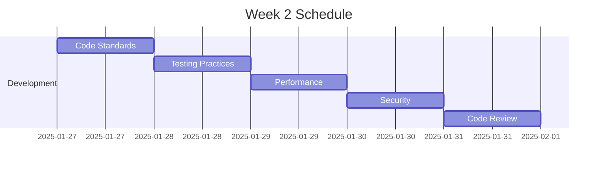

# Assessment Flow Engineering Excellence Program

## Overview

This training program ensures our engineering team maintains the highest standards of code quality, incident response, and system reliability for our Assessment Flow component.

## Training Modules

### 1. System Architecture
- [Architecture Overview](./architecture/README.md)
- [Data Flow](./architecture/data-flow.md)
- [State Management](./architecture/state-management.md)
- [Error Handling](./architecture/error-handling.md)

### 2. Development Standards
- [Code Quality Guidelines](./development/code-quality.md)
- [Testing Strategy](./development/testing.md)
- [Performance Optimization](./development/performance.md)
- [Security Best Practices](./development/security.md)

### 3. Incident Response
- [Alert Handling](./incidents/alert-handling.md)
- [Troubleshooting Guide](./incidents/troubleshooting.md)
- [Communication Templates](./incidents/communication.md)
- [Post-Mortem Process](./incidents/post-mortem.md)

### 4. Monitoring & Observability
- [Dashboard Usage](./monitoring/dashboards.md)
- [Metrics Understanding](./monitoring/metrics.md)
- [Log Analysis](./monitoring/logs.md)
- [Performance Analysis](./monitoring/performance.md)

## Training Schedule

### Week 1: System Fundamentals

### Week 2: Development Excellence

### Week 3: Incident Management

## Certification Process

### Level 1: System Knowledge
- Architecture understanding
- Development standards
- Testing practices
- Performance optimization

### Level 2: Incident Response
- Alert handling
- Problem diagnosis
- Communication
- Recovery procedures

### Level 3: System Expert
- Performance tuning
- Capacity planning
- Architecture design
- Mentoring others

## Resources

### Documentation
- System Architecture
- API Documentation
- Testing Guidelines
- Performance Benchmarks

### Tools
- Monitoring Dashboards
- Debugging Tools
- Performance Analyzers
- Testing Framework

### Contacts
- Technical Leads
- Subject Matter Experts
- Support Teams
- External Resources
