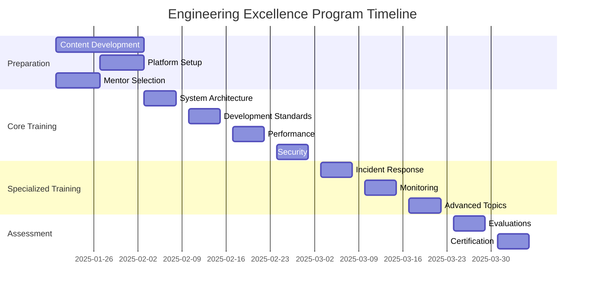

# Engineering Excellence Program Implementation Plan

## Program Overview

### Objectives
1. Establish engineering best practices
2. Improve system reliability
3. Enhance incident response
4. Drive continuous improvement

## Implementation Timeline



## Training Tracks

### 1. Core Engineering (Level 1)
- System Architecture
- Code Quality
- Testing
- Performance
- Security

### 2. Operational Excellence (Level 2)
- Monitoring
- Incident Response
- Problem Solving
- Communication
- Documentation

### 3. Technical Leadership (Level 3)
- System Design
- Mentoring
- Architecture Review
- Capacity Planning
- Strategic Planning

## Implementation Strategy

### Phase 1: Preparation (Weeks 1-2)

#### Content Development
```typescript
interface TrainingModule {
  title: string;
  level: 1 | 2 | 3;
  duration: number;
  prerequisites: string[];
  content: {
    theory: string[];
    practice: Exercise[];
    assessment: Assessment;
  };
}

const modules: TrainingModule[] = [
  {
    title: 'System Architecture',
    level: 1,
    duration: 5,
    prerequisites: [],
    content: {
      theory: [
        'Component Design',
        'State Management',
        'Error Handling',
        'Performance'
      ],
      practice: [
        {
          name: 'Component Optimization',
          difficulty: 'medium',
          timeLimit: 60
        }
      ],
      assessment: {
        type: 'practical',
        passingScore: 80
      }
    }
  }
  // More modules...
];
```

#### Platform Setup
```typescript
interface LearningPlatform {
  features: {
    contentDelivery: boolean;
    progressTracking: boolean;
    assessments: boolean;
    mentoring: boolean;
  };
  integrations: {
    github: boolean;
    slack: boolean;
    confluence: boolean;
  };
  metrics: {
    completion: boolean;
    satisfaction: boolean;
    effectiveness: boolean;
  };
}

const platformConfig: LearningPlatform = {
  features: {
    contentDelivery: true,
    progressTracking: true,
    assessments: true,
    mentoring: true
  },
  integrations: {
    github: true,
    slack: true,
    confluence: true
  },
  metrics: {
    completion: true,
    satisfaction: true,
    effectiveness: true
  }
};
```

### Phase 2: Core Training (Weeks 3-6)

#### Session Structure
```typescript
interface TrainingSession {
  duration: number;
  format: 'workshop' | 'lecture' | 'hands-on';
  schedule: {
    theory: number;
    practice: number;
    discussion: number;
  };
  materials: {
    slides: string;
    exercises: Exercise[];
    resources: Resource[];
  };
}

const sessionTemplate: TrainingSession = {
  duration: 240, // minutes
  format: 'workshop',
  schedule: {
    theory: 60,
    practice: 120,
    discussion: 60
  },
  materials: {
    slides: 'url-to-slides',
    exercises: [],
    resources: []
  }
};
```

### Phase 3: Specialized Training (Weeks 7-9)

#### Incident Response Training
```typescript
interface IncidentSimulation {
  scenario: {
    type: 'performance' | 'error' | 'security';
    severity: 1 | 2 | 3;
    description: string;
  };
  tasks: {
    detection: Task[];
    analysis: Task[];
    resolution: Task[];
    communication: Task[];
  };
  evaluation: {
    metrics: string[];
    criteria: string[];
    feedback: string[];
  };
}

const simulationExample: IncidentSimulation = {
  scenario: {
    type: 'performance',
    severity: 2,
    description: 'Assessment flow response time degradation'
  },
  tasks: {
    detection: [
      { name: 'Identify metrics', points: 10 },
      { name: 'Analyze patterns', points: 15 }
    ],
    analysis: [
      { name: 'Root cause analysis', points: 20 },
      { name: 'Impact assessment', points: 15 }
    ],
    resolution: [
      { name: 'Implement fix', points: 25 },
      { name: 'Verify solution', points: 15 }
    ],
    communication: [
      { name: 'Status updates', points: 10 },
      { name: 'Documentation', points: 10 }
    ]
  },
  evaluation: {
    metrics: ['time_to_detect', 'time_to_resolve', 'communication_quality'],
    criteria: ['accuracy', 'efficiency', 'communication'],
    feedback: ['strengths', 'improvements', 'recommendations']
  }
};
```

### Phase 4: Assessment & Certification (Weeks 10-11)

#### Evaluation Framework
```typescript
interface CertificationProgram {
  levels: {
    [key: number]: {
      requirements: string[];
      assessments: Assessment[];
      practicalProjects: Project[];
    };
  };
  tracking: {
    progress: Metric[];
    completion: Metric[];
    feedback: Metric[];
  };
  recognition: {
    badges: Badge[];
    certificates: Certificate[];
    rewards: Reward[];
  };
}

const certificationProgram: CertificationProgram = {
  levels: {
    1: {
      requirements: [
        'Complete core modules',
        'Pass assessments',
        'Complete project'
      ],
      assessments: [
        {
          type: 'theoretical',
          passing_score: 80,
          topics: ['architecture', 'performance', 'security']
        },
        {
          type: 'practical',
          passing_score: 85,
          projects: ['optimization', 'error-handling']
        }
      ],
      practicalProjects: [
        {
          name: 'Performance Optimization',
          requirements: ['Improve TTI by 20%', 'Reduce bundle size'],
          duration: 5
        }
      ]
    }
    // More levels...
  },
  tracking: {
    progress: [
      { name: 'module_completion', target: 100 },
      { name: 'assessment_scores', target: 85 }
    ],
    completion: [
      { name: 'certification_rate', target: 90 },
      { name: 'time_to_complete', target: 60 }
    ],
    feedback: [
      { name: 'satisfaction_score', target: 4.5 },
      { name: 'effectiveness_score', target: 4.5 }
    ]
  },
  recognition: {
    badges: [
      { name: 'Performance Expert', criteria: 'Complete performance module' },
      { name: 'Incident Master', criteria: 'Handle 5 incidents successfully' }
    ],
    certificates: [
      { name: 'Level 1 Engineer', validity: '2 years' },
      { name: 'Level 2 Engineer', validity: '2 years' }
    ],
    rewards: [
      { name: 'Conference Ticket', criteria: 'Top performer' },
      { name: 'Learning Budget', criteria: 'Complete all levels' }
    ]
  }
};
```

## Success Metrics

### 1. Training Effectiveness
```typescript
interface EffectivenessMetrics {
  completion_rate: number;
  assessment_scores: number;
  practical_application: number;
  feedback_scores: number;
}

const targetMetrics: EffectivenessMetrics = {
  completion_rate: 90,
  assessment_scores: 85,
  practical_application: 80,
  feedback_scores: 4.5
};
```

### 2. Operational Impact
```typescript
interface OperationalMetrics {
  incident_response_time: number;
  error_resolution_rate: number;
  system_reliability: number;
  team_productivity: number;
}

const operationalTargets: OperationalMetrics = {
  incident_response_time: -30, // 30% reduction
  error_resolution_rate: 95,
  system_reliability: 99.9,
  team_productivity: 20 // 20% increase
};
```

## Continuous Improvement

### 1. Feedback Loop
```typescript
interface FeedbackSystem {
  collection: {
    methods: string[];
    frequency: string;
    metrics: string[];
  };
  analysis: {
    tools: string[];
    frequency: string;
    actions: string[];
  };
  implementation: {
    process: string;
    timeline: string;
    validation: string;
  };
}

const feedbackSystem: FeedbackSystem = {
  collection: {
    methods: ['surveys', 'interviews', 'metrics'],
    frequency: 'weekly',
    metrics: ['satisfaction', 'effectiveness', 'relevance']
  },
  analysis: {
    tools: ['analytics', 'reporting', 'trending'],
    frequency: 'monthly',
    actions: ['content_updates', 'process_improvements']
  },
  implementation: {
    process: 'agile',
    timeline: 'quarterly',
    validation: 'metrics_based'
  }
};
```

### 2. Program Evolution
```typescript
interface ProgramEvolution {
  reviews: {
    frequency: string;
    metrics: string[];
    stakeholders: string[];
  };
  updates: {
    content: string;
    delivery: string;
    technology: string;
  };
  expansion: {
    topics: string[];
    levels: string[];
    reach: string[];
  };
}

const evolutionPlan: ProgramEvolution = {
  reviews: {
    frequency: 'quarterly',
    metrics: ['effectiveness', 'relevance', 'impact'],
    stakeholders: ['engineers', 'leads', 'management']
  },
  updates: {
    content: 'continuous',
    delivery: 'adaptive',
    technology: 'emerging'
  },
  expansion: {
    topics: ['ai', 'cloud', 'security'],
    levels: ['expert', 'architect', 'leader'],
    reach: ['global', 'partners', 'community']
  }
};
```
